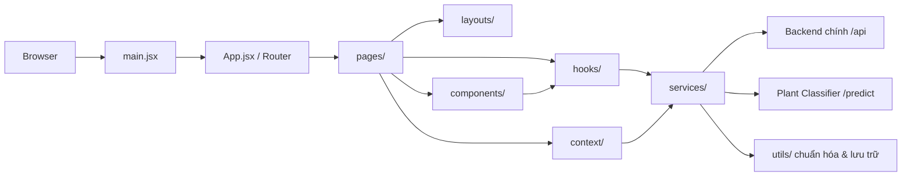
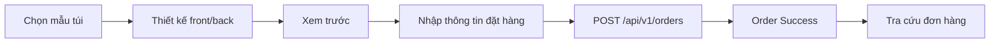
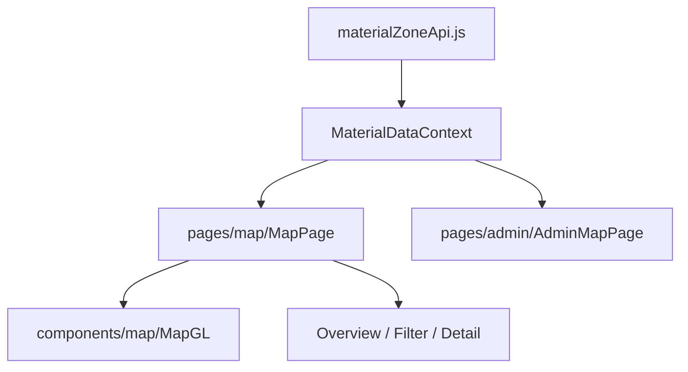
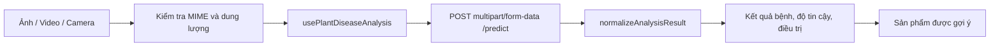

# GreenShield Mekong - Tổng quan dự án

> Tài liệu phản ánh cấu trúc source hiện tại ngày 26/07/2026. Repository này chứa frontend SPA; các backend Spring Boot/Python được gọi qua HTTP nhưng không nằm trong repository.

## 1. Mục tiêu dự án

GreenShield Mekong là ứng dụng web giới thiệu và vận hành hệ sinh thái bao bì xanh. Frontend hiện bao gồm:

- Website giới thiệu dự án và các nội dung ESG.
- Lab chọn mẫu và thiết kế túi tùy chỉnh.
- Công cụ AI tạo hình ảnh/thiết kế túi.
- Tạo QR và nội dung audio gắn với sản phẩm.
- Quy trình xem trước, thanh toán và tra cứu đơn hàng.
- Bản đồ vùng nguyên liệu, nông hộ và điểm thu gom.
- Trang quản trị mẫu túi, texture, đơn hàng và dữ liệu bản đồ.
- Chatbot GreenShield.
- AI Bệnh Lá nhận ảnh, video hoặc camera để phân tích bệnh và gợi ý sản phẩm.

## 2. Công nghệ chính

| Nhóm | Công nghệ |
| --- | --- |
| UI runtime | React 19, React DOM |
| Build tool | Vite 7 |
| Routing | React Router DOM 7 |
| UI components | Ant Design, Base UI, Radix/Shadcn-related packages |
| Styling | CSS thường, CSS Modules, Tailwind CSS 4 utilities |
| Animation | GSAP, Framer Motion, Motion, AOS |
| Canvas editor | Fabric.js |
| 3D/WebGL | Three.js, React Three Fiber, Globe.gl |
| Map | MapLibre GL, React Globe GL, Leaflet cluster packages |
| Charts | Recharts |
| Đa ngôn ngữ | i18next, react-i18next |
| Markdown/chat | react-markdown, remark-gfm |
| Icon | Lucide React, React Icons, Ant Design Icons |
| Lưu trữ trình duyệt | localStorage, sessionStorage, IndexedDB |
| Hosting | Cloudflare Workers/Assets thông qua Wrangler |
| Lint | ESLint 9, React Hooks rules |

## 3. Kiến trúc tổng quát

Ứng dụng đang dùng kiến trúc frontend theo các tầng thư mục sẵn có, không dùng thư mục `features`:



### Quy tắc trách nhiệm

| Thư mục | Trách nhiệm |
| --- | --- |
| `src/pages/` | Route-level page, ghép layout và các component thành màn hình hoàn chỉnh |
| `src/components/` | UI dùng lại hoặc UI chuyên biệt của một module |
| `src/hooks/` | State, side effects và orchestration dùng lại |
| `src/services/` | Gọi HTTP API và xử lý giao tiếp backend |
| `src/context/` | State chia sẻ qua React Context |
| `src/utils/` | Chuẩn hóa dữ liệu, lưu trữ và helper không phụ thuộc UI |
| `src/layouts/` | Khung trang dùng chung cho public, custom bag và admin |
| `src/sections/` | Các section của landing page |
| `src/data/` | Dữ liệu tĩnh/địa lý phía frontend |
| `src/styles/` | CSS nền tảng và CSS dùng chung toàn ứng dụng |

## 4. Cấu trúc repository

```text
green_shield/
├── docs/                         # Ghi chú kỹ thuật và báo cáo dọn CSS
├── public/                       # Static assets phục vụ trực tiếp
├── scripts/
│   └── bundle-budget.mjs         # Kiểm tra ngân sách bundle
├── src/
│   ├── assets/                   # Logo, hình ảnh, video, audio
│   ├── components/
│   │   ├── design/               # Toolbar/panel của lab thiết kế
│   │   ├── map/                  # MapGL và floating panels
│   │   ├── plant-disease/        # Input, output và gợi ý sản phẩm AI Bệnh Lá
│   │   ├── ui/                   # Các primitive UI/hiệu ứng dùng lại
│   │   └── *.jsx                 # Navigation, chat, loading, utilities UI
│   ├── context/
│   │   └── MaterialDataContext.jsx
│   ├── data/                     # Danh sách địa điểm và GeoJSON đảo Việt Nam
│   ├── hooks/                    # Hooks cho design, QR, AI, map section, bệnh lá
│   ├── layouts/                  # MainLayout, CustomBagLayout, AdminLayout
│   ├── lib/                      # Utility nền tảng (`cn`/class helpers)
│   ├── locales/                  # `vi.json`, `en.json`
│   ├── pages/
│   │   ├── admin/                # Đăng nhập và các màn hình quản trị
│   │   ├── custom-bag/           # Chọn mẫu, preview, checkout
│   │   ├── map/                  # Bản đồ public
│   │   ├── media/                # Audio và audio file
│   │   ├── order/                # Tra cứu và hoàn tất đơn hàng
│   │   ├── plant-disease/        # Route page AI Bệnh Lá
│   │   ├── shared/               # Loading dùng chung ở cấp page
│   │   └── DesignPage.jsx        # Editor thiết kế chính đang được route sử dụng
│   ├── sections/                 # Landing-page sections và dữ liệu bản đồ nền
│   ├── services/                 # API clients
│   ├── styles/                   # Global/base/skeleton/chat/process styles
│   ├── utils/                    # IndexedDB và normalize kết quả bệnh lá
│   ├── App.jsx                   # Router và composition cấp ứng dụng
│   ├── i18n.js                   # Khởi tạo i18next
│   ├── index.css                 # CSS entry
│   └── main.jsx                  # React entry point
├── .env                          # Biến môi trường local, không ghi giá trị vào tài liệu
├── eslint.config.js
├── package.json
├── tailwind.config.js / .ts
├── tsconfig.json
├── vite.config.js
└── wrangler.jsonc
```

## 5. Entry point và vòng đời ứng dụng

### `src/main.jsx`

- Import Ant Design reset CSS và `src/index.css`.
- Khởi tạo i18n.
- Preload/prefetch ảnh hero cho màn hình lớn khi người dùng không bật tiết kiệm dữ liệu hoặc giảm chuyển động.
- Render ứng dụng trong `React.StrictMode` và `AntApp`.

### `src/App.jsx`

- Khởi tạo `BrowserRouter`.
- Lazy-load phần lớn page và component nặng.
- Điều khiển theme theo route qua `ThemeRouteScope`.
- Render landing page theo các section.
- Khai báo public routes, custom bag routes và admin nested routes.
- Bọc routes bằng `MaterialDataProvider` để cung cấp dữ liệu vùng nguyên liệu.
- Route không tồn tại được chuyển về `/`.

## 6. Danh sách routes

| Route | Màn hình | Quyền truy cập/Ghi chú |
| --- | --- | --- |
| `/` | Landing page | Public |
| `/custom-bag` | Chọn mẫu túi | Public; có intro loading khi đi từ trang chủ |
| `/custom-bag/:templateId/design` | Lab thiết kế | Public |
| `/custom-bag/:templateId/preview` | Xem trước thiết kế | Public |
| `/custom-bag/:templateId/checkout` | Thanh toán/đặt hàng | Public |
| `/order-success` | Hoàn tất đơn hàng | Public |
| `/order-lookup` | Tra cứu đơn hàng | Public |
| `/audio/:code` | Phát nội dung audio theo code | Public |
| `/tts/:code` | Alias của trang audio | Public |
| `/audio-file/:id` | Phát file audio theo ID | Public |
| `/map` | Bản đồ vùng nguyên liệu | Public, dùng `MainLayout` |
| `/plant-disease` | AI Bệnh Lá | Public, lazy-loaded |
| `/admin` | Đăng nhập quản trị | Public entry |
| `/admin/dashboard/overview` | Tổng quan admin | Protected; hiện là placeholder |
| `/admin/dashboard/bag-templates` | Quản lý mẫu túi | Protected |
| `/admin/dashboard/textures` | Quản lý texture | Protected |
| `/admin/dashboard/orders` | Quản lý đơn hàng | Protected |
| `/admin/dashboard/map` | Quản trị vùng nguyên liệu | Protected |
| `/admin/dashboard/settings` | Cài đặt | Protected; hiện là placeholder |
| `/admin/textures` | Redirect | Chuyển đến dashboard textures |

## 7. Landing page

Landing page được ghép trực tiếp trong `MainSite` bằng các section:

1. `HomeSection`
2. `AboutSection`
3. `MissionSection`
4. `ProductsSection`
5. `AdvantagesSection`
6. `CommunitySection`
7. `ContactSection`

Các widget `ChatWidget` và `BackToTop` được trì hoãn đến lúc browser idle hoặc hết timeout nhằm giảm tải ban đầu.

Navigation hỗ trợ:

- Cuộn mượt đến section trên trang chủ.
- Đánh dấu section đang active bằng Intersection Observer.
- Điều hướng đến custom bag, map và AI Bệnh Lá.
- Menu drawer cho màn hình hẹp.
- Chuyển đổi tiếng Việt/tiếng Anh.

## 8. Module Custom Bag và Design Lab

### Luồng người dùng



### Chức năng editor

- Fabric canvas với vùng clip theo template.
- Thiết kế riêng mặt trước và mặt sau.
- Thêm text, icon, ảnh, texture và màu nền.
- Layer manager, context menu, snap guides, zoom và history.
- Lưu snapshot thiết kế vào `localStorage`.
- Green AI tạo artwork cho mặt trước/mặt sau.
- Green QR tạo QR, ghi âm hoặc gắn nội dung audio.
- Lưu ảnh AI sinh ra trong IndexedDB để tránh giới hạn nhỏ của localStorage.

### Các file chính

- `src/pages/DesignPage.jsx`: editor hiện được route sử dụng.
- `src/components/design/`: panel và toolbar của editor.
- `src/hooks/useEditorState.js`: state UI của editor.
- `src/hooks/useFabricCanvas.js`: thao tác canvas.
- `src/hooks/useGreenAi.js`: luồng tạo artwork AI.
- `src/hooks/useGreenQr.js`: luồng QR/audio.
- `src/services/bagTemplate.js`: dữ liệu mẫu túi.
- `src/services/texture.js`: texture và authentication.
- `src/services/ai.js`: AI tạo ảnh/thiết kế.
- `src/utils/aiGeneratedStorage.js`: IndexedDB cho tài nguyên AI.

## 9. Module đơn hàng

`src/services/order.js` cung cấp:

- Tạo đơn hàng public.
- Tra cứu đơn hàng theo ID.
- Danh sách đơn hàng cho admin, có lọc status.
- Xem chi tiết đơn hàng admin.
- Cập nhật trạng thái đơn hàng.

Admin API sử dụng cookie session với `credentials: 'include'`.

## 10. Module bản đồ vùng nguyên liệu

### Dữ liệu chính

- Zones: vùng nguyên liệu.
- Farmers: nông hộ.
- Collection points: điểm thu gom.
- Stats: số liệu tổng hợp.

### Luồng dữ liệu



`MaterialDataContext` tải song song zones, farmers và collection points; đồng thời cung cấp CRUD methods cho admin.

## 11. Module AI Bệnh Lá

### Vị trí file

```text
src/pages/plant-disease/
├── PlantDiseasePage.jsx
├── PlantDiseasePage.module.css
├── README.md
└── index.js

src/components/plant-disease/
├── InputPanel.jsx
├── OutputPanel.jsx
└── SuggestedProductsPanel.jsx

src/hooks/usePlantDiseaseAnalysis.js
src/services/plantDiseaseApi.js
src/utils/plantDiseaseResult.js
```

### Luồng xử lý



### Định dạng đầu vào

| Loại | Định dạng | Giới hạn frontend |
| --- | --- | --- |
| Ảnh | JPG, PNG, WebP | 10 MB |
| Video | MP4, WebM, MOV | 50 MB |
| Camera | Chụp thành JPEG | Theo giới hạn ảnh |

### API

- Method: `POST`
- Endpoint: `/predict`
- Body: `multipart/form-data`
- Field: `file`
- Dev fallback: `http://localhost:7860`
- Env ưu tiên: `VITE_PLANT_DISEASE_API_BASE`, sau đó `VITE_PY_API_BASE`

Kết quả được chuẩn hóa về camelCase và gồm plant name, scientific name, status, confidence, severity, symptoms, treatment, recovery và suggested products.

Số lần phân tích thành công trong phiên được lưu tại `sessionStorage` với key `plant_disease_analysis_count`.

## 12. Module audio và QR

- `/audio/:code` và `/tts/:code` hiển thị nội dung audio theo code.
- `/audio-file/:id` phát file audio theo ID.
- Theme của các page audio được lưu trong `localStorage`.
- `useGreenQr` chịu trách nhiệm tạo QR, quản lý nội dung và ghi âm trong Design Lab.

## 13. Chatbot

`src/services/chat.js` gọi các endpoint:

| Method | Endpoint | Mục đích |
| --- | --- | --- |
| `GET` | `/api/v1/chat/topics` | Lấy danh sách chủ đề |
| `POST` | `/api/v1/chat/select-topic` | Chọn chủ đề hội thoại |
| `POST` | `/api/v1/chat/message` | Gửi tin nhắn và nhận trả lời AI |

Chat sử dụng cookie session qua `credentials: 'include'`.

## 14. Admin và authentication

- Entry login: `/admin`.
- `ProtectedRoute` gọi API kiểm tra session trước khi cho vào dashboard.
- `AdminLayout` dùng Ant Design Layout/Menu.
- Logout gọi `/api/v1/auth/logout` rồi chuyển về trang login.
- Các module quản trị hiện có: mẫu túi, texture, đơn hàng và bản đồ.

## 15. API clients

| File | Base/Endpoint chính | Trách nhiệm |
| --- | --- | --- |
| `services/bagTemplate.js` | `/api/v1/bag-templates`, `/api/v1/admin/bag-templates` | Public/admin bag templates |
| `services/texture.js` | `/api/v1/textures`, `/api/v1/admin/textures`, `/api/v1/auth/*` | Texture và auth |
| `services/order.js` | `/api/v1/orders`, `/api/v1/admin/orders` | Đơn hàng |
| `services/ai.js` | `/api/v1/ai/*` | Tạo ảnh và thiết kế túi bằng AI |
| `services/chat.js` | `/api/v1/chat/*` | Chatbot |
| `services/materialZoneApi.js` | `/api/material-zones/*` | Zones, farmers, collection points, stats |
| `services/plantDiseaseApi.js` | `/predict` | Phân tích bệnh lá |

Phần lớn backend chính dùng `VITE_API_BASE`. Khi base rỗng, request được gọi relative theo origin hiện tại; Vite dev server proxy các request `/api` nếu `VITE_API_BASE` được cấu hình.

## 16. State và lưu trữ phía client

| Storage | Dữ liệu |
| --- | --- |
| React state/hooks | State màn hình, editor, map, request loading/error |
| React Context | Zones, farmers, collection points và CRUD actions |
| `localStorage` | Theme, snapshot thiết kế và một số fallback legacy |
| `sessionStorage` | Bộ đếm phân tích bệnh lá trong phiên |
| IndexedDB | Các ảnh được Green AI sinh ra |
| Cookie session | Authentication/admin và một số backend flows |

## 17. Đa ngôn ngữ

- File khởi tạo: `src/i18n.js`.
- Ngôn ngữ mặc định: `vi`.
- Fallback: `en`.
- Resource files: `src/locales/vi.json`, `src/locales/en.json`.
- Navigation và phần lớn landing/map sử dụng translation keys.
- Một số màn hình chuyên biệt vẫn còn text hard-code bằng tiếng Việt hoặc tiếng Anh.

## 18. Styling và theme

- `src/index.css` là CSS entry toàn ứng dụng.
- `src/styles/base.css`, `global.css`, `_variables.css` chứa nền tảng dùng chung.
- Một số module dùng CSS riêng theo page.
- AI Bệnh Lá dùng CSS Module để tránh xung đột global selectors.
- Dark/light theme lưu trong `greenshield-theme` và được `ThemeRouteScope` áp dụng theo nhóm route.
- Design/audio/custom/order routes thuộc nhóm hỗ trợ dark theme.

## 19. Assets và dữ liệu tĩnh

### Assets

- Logo GreenShield ở PNG/SVG.
- Hero background có PNG, WebP và AVIF.
- Video giới thiệu và video transparency.
- Hình community, mascot, market, mission và chatbox.
- Audio mascot `Lubi-sound.m4a`.

### Dữ liệu địa lý

- `src/data/vietnamLocations.js`
- `src/data/vietnam-islands.geojson`
- `src/sections/vietnam.geo.json`
- `src/sections/world.geo.json`
- `src/sections/vietnam.dots.json`
- `src/sections/world.dots.json`

## 20. Biến môi trường

Không ghi giá trị thật hoặc secret vào tài liệu/commit. Các key hiện có hoặc được code hỗ trợ:

| Biến | Bắt buộc | Mục đích |
| --- | --- | --- |
| `VITE_API_BASE` | Tùy môi trường | Backend chính cho `/api/v1` và material zones |
| `VITE_PLANT_DISEASE_API_BASE` | Khuyến nghị nếu classifier khác origin | Backend Python AI Bệnh Lá |
| `VITE_PY_API_BASE` | Tùy chọn/legacy | Alias tương thích cho classifier |
| `VITE_GOOGLE_MAPS_API_KEY` | Hiện chưa thấy runtime reference | Cấu hình Google Maps cũ hoặc dự phòng |
| `VITE_FIREBASE_*` | Hiện chưa thấy runtime reference | Cấu hình Firebase cũ hoặc dự phòng |

Ví dụ local:

```env
VITE_API_BASE=http://localhost:8080
VITE_PLANT_DISEASE_API_BASE=http://localhost:7860
```

## 21. Scripts

| Command | Mục đích |
| --- | --- |
| `npm run dev` | Chạy Vite development server |
| `npm run build` | Build production bundle |
| `npm run lint` | Chạy ESLint toàn repository |
| `npm run preview` | Build rồi chạy local bằng Wrangler |
| `npm run deploy` | Build và deploy Cloudflare |

Khởi động local:

```bash
npm install
npm run dev
```

Backend AI Bệnh Lá cần chạy riêng tại port cấu hình, mặc định local là `7860`.

## 22. Build và deploy

`vite.config.js` hiện:

- Dùng React, Tailwind và Cloudflare Vite plugins.
- Khai báo alias `@` trỏ đến `src`.
- Proxy `/api` đến `VITE_API_BASE` khi biến này có giá trị.
- Tách manual chunks cho Three.js, globe stack, Fabric, Ant Design và map libraries.
- Cho phép chunk warning đến 1450 KB.

`wrangler.jsonc` cấu hình:

- Cloudflare app name: `green`.
- SPA fallback thông qua `not_found_handling: single-page-application`.
- Bật observability.
- Bật `nodejs_compat`.

## 23. Quy ước phát triển

- Page mới đặt trong domain folder thuộc `src/pages/`.
- Mỗi domain page có `index.js` làm barrel export.
- UI của module đặt trong `src/components/<module>/`.
- Hook dùng lại đặt tại `src/hooks/`.
- HTTP client đặt tại `src/services/`.
- Helper/normalizer đặt tại `src/utils/`.
- Không đặt UI, hook hoặc repository vào `src/data/`.
- Page component đặt tên `FeatureNamePage.jsx`.
- CSS page đặt gần page; ưu tiên CSS Module cho module độc lập.
- Không hard-code backend production; sử dụng biến `VITE_*`.

## 24. Các điểm cần lưu ý/technical debt hiện tại

### File page bị trùng

Repository vẫn có một số bản flat và bản domain-folder cùng tồn tại:

- `pages/AdminMapPage.jsx` và `pages/admin/AdminMapPage.jsx`
- `pages/BagTemplateManagementPage.jsx` và `pages/admin/BagTemplateManagementPage.jsx`
- `pages/BagTemplateSelectPage.jsx` và `pages/custom-bag/BagTemplateSelectPage.jsx`
- `pages/MapPage.jsx` và `pages/map/MapPage.jsx`
- `pages/OrderLookupPage.jsx` và `pages/order/OrderLookupPage.jsx`
- `pages/TextureManagementPage.jsx` và `pages/admin/TextureManagementPage.jsx`
- `pages/DesignPage.jsx` và implementation khác trong `pages/DesignPage/index.jsx`

Router hiện ưu tiên các domain barrels cho admin/custom-bag/map/order/media/plant-disease. `DesignPage` đang được import qua `./pages/DesignPage`, vì vậy cần kiểm tra resolution trước khi xóa hoặc hợp nhất hai implementation.

### Kiểm tra chất lượng hiện tại

- Chưa có script test tự động trong `package.json`.
- Full build từng bị chặn bởi cú pháp import Fabric v7 dạng `import { fabric } from 'fabric'` trong `DesignPreviewCanvas.jsx`.
- ESLint toàn project còn lỗi/warning ngoài module plant-disease, gồm unused variables và hook dependencies.
- `MaterialDataProvider` đang bọc toàn bộ routes dù dữ liệu chủ yếu phục vụ map.
- Một số text tiếng Việt trong source có dấu hiệu encoding không đồng nhất khi hiển thị qua terminal.
- Một số CSS/page legacy vẫn tồn tại song song với cấu trúc domain mới.

Các mục trên nên được xử lý theo từng PR nhỏ để tránh ảnh hưởng nhiều feature cùng lúc.

## 25. Thứ tự đọc code đề xuất

Cho thành viên mới:

1. `src/main.jsx`
2. `src/App.jsx`
3. `src/components/Nav.jsx`
4. `src/pages/README.md`
5. Domain page cần làm việc trong `src/pages/<domain>/`
6. Component tương ứng trong `src/components/`
7. Hook tương ứng trong `src/hooks/`
8. API client tương ứng trong `src/services/`
9. `vite.config.js`, `.env` và `wrangler.jsonc` khi cần chạy/deploy

## 26. File tham chiếu nhanh

| Nhu cầu | File bắt đầu |
| --- | --- |
| Thêm/sửa route | `src/App.jsx` |
| Sửa menu | `src/components/Nav.jsx` |
| Sửa landing page | `src/sections/` |
| Sửa Design Lab | `src/pages/DesignPage.jsx` |
| Sửa AI/QR trong editor | `src/hooks/useGreenAi.js`, `src/hooks/useGreenQr.js` |
| Sửa flow custom bag | `src/pages/custom-bag/` |
| Sửa đơn hàng | `src/pages/order/`, `src/services/order.js` |
| Sửa bản đồ public | `src/pages/map/`, `src/components/map/` |
| Sửa dữ liệu bản đồ | `src/context/MaterialDataContext.jsx`, `src/services/materialZoneApi.js` |
| Sửa admin | `src/pages/admin/`, `src/layouts/AdminLayout.jsx` |
| Sửa chatbot | `src/components/ChatWidget.jsx`, `src/services/chat.js` |
| Sửa AI Bệnh Lá | `src/pages/plant-disease/`, `src/components/plant-disease/`, `src/services/plantDiseaseApi.js` |
| Sửa ngôn ngữ | `src/locales/vi.json`, `src/locales/en.json` |
| Sửa theme/global CSS | `src/index.css`, `src/styles/` |
| Sửa build/deploy | `vite.config.js`, `wrangler.jsonc` |

