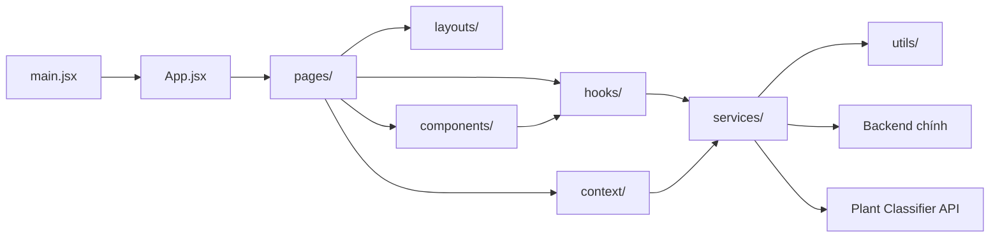

# Cấu trúc dự án GreenShield Mekong

> Cập nhật theo workspace ngày 31/07/2026. Tài liệu bao gồm cả module sản phẩm đang được phát triển và chưa commit.

## 1. Tổng quan

Repository này là frontend SPA của GreenShield Mekong, được xây dựng bằng React và Vite. Ứng dụng tích hợp nhiều nhóm chức năng:

- Website giới thiệu dự án GreenShield Mekong.
- Danh mục và chi tiết sản phẩm.
- Lab thiết kế túi bằng Fabric.js.
- AI tạo thiết kế và QR/audio.
- Đặt hàng và tra cứu đơn hàng.
- Bản đồ vùng nguyên liệu.
- AI Bệnh Lá.
- Chatbot.
- Trang quản trị sản phẩm, mẫu túi, texture, đơn hàng và bản đồ.

Backend không nằm trong repository này. Frontend giao tiếp với:

- Backend chính qua các endpoint `/api` và `/api/v1`.
- Backend Python phân tích bệnh lá qua `/predict`.

## 2. Sơ đồ kiến trúc



### Luồng phụ thuộc chuẩn

```text
Page
├── Layout
├── Component
├── Hook
│   └── Service
│       └── Utility/Normalizer
└── Context
    └── Service
```

Quy tắc chính:

- `pages` chỉ chịu trách nhiệm tạo màn hình và ghép các thành phần.
- `components` chứa giao diện dùng lại hoặc giao diện riêng của module.
- `hooks` quản lý state và side effects.
- `services` là lớp giao tiếp HTTP.
- `utils` chứa helper, normalizer và lưu trữ phía client.
- `data` chỉ chứa dữ liệu tĩnh, không chứa component hoặc API repository.

## 3. Cấu trúc thư mục gốc

```text
green_shield/
├── .git/                         # Git metadata
├── .wrangler/                    # Dữ liệu local của Cloudflare Wrangler
├── dist/                         # Production build output
├── docs/                         # Tài liệu kỹ thuật
├── node_modules/                 # Dependencies đã cài đặt
├── public/                       # Static files phục vụ trực tiếp
├── scripts/                      # Script hỗ trợ build/quality
├── src/                          # Toàn bộ source frontend
├── .env                          # Biến môi trường local
├── .gitignore
├── components.json              # Cấu hình component tooling
├── eslint.config.js             # ESLint configuration
├── index.html                   # HTML entry
├── package.json                 # Scripts và dependencies
├── package-lock.json
├── postcss.config.js
├── SETUP_GOOGLE_MAPS.md
├── tailwind.config.js
├── tailwind.config.ts
├── tsconfig.json
├── vite.config.js
└── wrangler.jsonc               # Cloudflare configuration
```

## 4. Cấu trúc thư mục `src`

```text
src/
├── assets/
├── components/
│   ├── design/
│   ├── map/
│   ├── plant-disease/
│   ├── ui/
│   └── *.jsx
├── context/
├── data/
├── hooks/
├── layouts/
├── lib/
├── locales/
├── pages/
│   ├── admin/
│   ├── custom-bag/
│   ├── DesignPage/
│   ├── map/
│   ├── media/
│   ├── order/
│   ├── plant-disease/
│   ├── products/
│   └── shared/
├── sections/
├── services/
├── styles/
├── utils/
├── App.jsx
├── i18n.js
├── index.css
└── main.jsx
```

## 5. Entry point và routing

### `src/main.jsx`

- Khởi tạo React root.
- Bọc ứng dụng bằng `React.StrictMode` và Ant Design `App`.
- Import CSS global và cấu hình i18n.
- Preload ảnh hero khi thiết bị phù hợp.

### `src/App.jsx`

- Khai báo toàn bộ routes.
- Lazy-load các page lớn.
- Ghép landing page từ các section.
- Điều khiển theme theo route.
- Bọc ứng dụng bằng `MaterialDataProvider`.
- Redirect route không tồn tại về trang chủ.

### Routes hiện tại

| Route | Page | Chức năng |
| --- | --- | --- |
| `/` | `MainSite` | Landing page |
| `/products` | `ProductsPage` | Danh mục sản phẩm public |
| `/products/:slug` | `ProductDetailPage` | Chi tiết sản phẩm |
| `/custom-bag` | `BagTemplateSelectPage` | Chọn mẫu túi |
| `/custom-bag/:templateId/design` | `DesignPage` | Thiết kế túi |
| `/custom-bag/:templateId/preview` | `PreviewPage` | Xem trước thiết kế |
| `/custom-bag/:templateId/checkout` | `CheckoutPage` | Đặt hàng |
| `/order-success` | `OrderSuccessPage` | Hoàn tất đơn hàng |
| `/order-lookup` | `OrderLookupPage` | Tra cứu đơn hàng |
| `/audio/:code` | `AudioPage` | Phát audio theo code |
| `/tts/:code` | `AudioPage` | Alias của audio page |
| `/audio-file/:id` | `AudioFilePage` | Phát audio theo file ID |
| `/plant-disease` | `PlantDiseasePage` | AI Bệnh Lá |
| `/map` | `MapPage` | Bản đồ vùng nguyên liệu |
| `/admin` | `LoginPage` | Đăng nhập admin |
| `/admin/dashboard/overview` | `DashboardOverview` | Tổng quan admin |
| `/admin/dashboard/bag-templates` | `BagTemplateManagementPage` | Quản lý mẫu túi |
| `/admin/dashboard/textures` | `TextureManagementPage` | Quản lý texture |
| `/admin/dashboard/orders` | `OrderManagementPage` | Quản lý đơn hàng |
| `/admin/dashboard/products` | `ProductManagementPage` | Quản lý sản phẩm |
| `/admin/dashboard/map` | `AdminMapPage` | Quản lý vùng nguyên liệu |
| `/admin/dashboard/settings` | `DashboardSettings` | Cài đặt admin |

## 6. `src/pages`

Các page được nhóm theo domain. Mỗi domain nên có `index.js` để export page cho router.

### `pages/products`

```text
pages/products/
├── ProductDetailPage.jsx
├── ProductsPage.jsx
├── index.js
├── products.css
└── productView.js
```

Chức năng:

- Hiển thị catalog sản phẩm từ API.
- Loading skeleton, empty state và retry state.
- Hiển thị sản phẩm nổi bật và câu chuyện vật liệu.
- Chi tiết sản phẩm theo slug.
- Gallery, thumbnails và lightbox.
- Nội dung được localize theo tiếng Việt/Anh.
- Cập nhật `document.title` và meta description.
- Helper `productView.js` xử lý tên, mô tả, giá tiền và URL ảnh.

### `pages/custom-bag`

```text
pages/custom-bag/
├── BagTemplateSelectPage.jsx
├── PreviewPage.jsx
├── CheckoutPage.jsx
├── *.css
└── index.js
```

Chịu trách nhiệm cho luồng:

```text
Chọn mẫu -> Thiết kế -> Preview -> Checkout -> Order Success
```

### `pages/DesignPage.jsx`

Editor chính hiện được router import qua `./pages/DesignPage`.

Chức năng chính:

- Fabric canvas.
- Mặt trước/mặt sau của túi.
- Text, icon, texture, màu nền và ảnh.
- Layer, undo/redo, zoom và snap guides.
- AI tạo artwork.
- QR và audio.
- Lưu snapshot thiết kế trong `localStorage`.

Thư mục `pages/DesignPage/` chứa một implementation được tách nhỏ theo component/hook nhưng hiện vẫn tồn tại song song với file `pages/DesignPage.jsx`.

### `pages/order`

- `OrderSuccessPage.jsx`: thông báo kết quả đặt hàng.
- `OrderLookupPage.jsx`: tra cứu đơn hàng theo mã.
- `index.js`: barrel export.

### `pages/media`

- `AudioPage.jsx`: phát audio theo code hoặc TTS code.
- `AudioFilePage.jsx`: phát file audio theo ID.

### `pages/map`

- Hiển thị MapLibre map.
- Bộ lọc vùng, nông hộ và điểm thu gom.
- Tổng hợp số liệu tồn kho và công suất.
- Dùng dữ liệu từ `MaterialDataContext`.

### `pages/plant-disease`

```text
pages/plant-disease/
├── PlantDiseasePage.jsx
├── PlantDiseasePage.module.css
├── README.md
└── index.js
```

Page chỉ ghép UI, hook và kết quả. Logic chi tiết nằm tại:

- `components/plant-disease/`
- `hooks/usePlantDiseaseAnalysis.js`
- `services/plantDiseaseApi.js`
- `utils/plantDiseaseResult.js`

### `pages/admin`

```text
pages/admin/
├── LoginPage.jsx
├── DashboardOverview.jsx
├── DashboardSettings.jsx
├── BagTemplateManagementPage.jsx
├── TextureManagementPage.jsx
├── OrderManagementPage.jsx
├── ProductManagementPage.jsx
├── AdminMapPage.jsx
├── *.css
└── index.js
```

`ProductManagementPage` mới hỗ trợ:

- Tạo, sửa và xóa sản phẩm.
- Bật/tắt trạng thái active.
- Bật/tắt featured.
- Thay đổi thứ tự hiển thị.
- Upload nhiều ảnh.
- Cập nhật metadata ảnh.
- Chọn ảnh chính.
- Sắp xếp hoặc xóa ảnh.

### `pages/shared`

Chứa page-level state dùng chung, hiện có `LabLoading`.

## 7. `src/components`

### Component dùng chung

| File | Trách nhiệm |
| --- | --- |
| `Nav.jsx` | Navigation desktop/mobile và active section |
| `LanguageToggle.jsx` | Chuyển đổi ngôn ngữ |
| `ChatWidget.jsx` | Chatbot UI |
| `ChatMarkdown.jsx` | Render nội dung Markdown trong chat |
| `ProtectedRoute.jsx` | Kiểm tra authentication admin |
| `BackToTop.jsx` | Nút quay lại đầu trang |
| `ImageAreaSelector.jsx` | Chọn vùng ảnh |
| `DesignPreviewCanvas.jsx` | Preview thiết kế bằng Fabric |
| `Marquee.jsx` | Nội dung chạy ngang |
| `NumberTicker.jsx` | Hiệu ứng số |
| `SplitText.jsx` | Hiệu ứng text |

### `components/design`

- `Topbar.jsx`
- `LeftPanel.jsx`
- `FloatingToolbar.jsx`
- `AiPanelsPremium.jsx`

Đây là các UI panel cho Design Lab.

### `components/map`

- `MapGL.jsx`: map engine.
- `FloatingOverview.jsx`: số liệu tổng quan.
- `FloatingFilter.jsx`: bộ lọc.
- `FloatingDetail.jsx`: thông tin đối tượng được chọn.
- `mapTheme.js`: cấu hình map style.

### `components/plant-disease`

- `InputPanel.jsx`: upload ảnh/video và camera.
- `OutputPanel.jsx`: kết quả phân tích.
- `SuggestedProductsPanel.jsx`: sản phẩm được AI gợi ý.

### `components/ui`

Các primitive và hiệu ứng dùng lại như dock, ripple, grid pattern, WebGL background và skeleton.

## 8. `src/hooks`

| Hook | Trách nhiệm |
| --- | --- |
| `useActiveSection.js` | Theo dõi section active trên landing page |
| `useEditorState.js` | State UI của Design Lab |
| `useFabricCanvas.js` | Điều khiển Fabric canvas |
| `useGreenAi.js` | AI tạo hình/thiết kế túi |
| `useGreenQr.js` | QR, audio và recording |
| `usePlantDiseaseAnalysis.js` | State phân tích bệnh lá |

## 9. `src/services`

| Service | Endpoint chính | Trách nhiệm |
| --- | --- | --- |
| `ai.js` | `/api/v1/ai/*` | AI tạo ảnh và thiết kế túi |
| `bagTemplate.js` | `/api/v1/bag-templates` | Mẫu túi public/admin |
| `chat.js` | `/api/v1/chat/*` | Chatbot |
| `materialZoneApi.js` | `/api/material-zones/*` | Vùng, nông hộ, điểm thu gom |
| `order.js` | `/api/v1/orders` | Đơn hàng public/admin |
| `plantDiseaseApi.js` | `/predict` | AI Bệnh Lá |
| `product.js` | `/api/v1/products`, `/api/v1/admin/products` | Catalog và quản trị sản phẩm |
| `texture.js` | `/api/v1/textures`, `/api/v1/auth/*` | Texture và authentication |

### Product API

Public:

- `GET /api/v1/products`
- `GET /api/v1/products/:slug`

Admin:

- CRUD `/api/v1/admin/products`
- Cập nhật active, featured và display order.
- Upload, cập nhật, xóa, reorder và chọn ảnh chính.

### Plant Disease API

- `POST /predict`
- `multipart/form-data`
- Field: `file`
- Ảnh: JPG, PNG, WebP, tối đa 10 MB.
- Video: MP4, WebM, MOV, tối đa 50 MB.
- Camera được chuyển thành JPEG.
- Dev mặc định: `http://localhost:7860`.

## 10. `src/context`

### `MaterialDataContext.jsx`

Quản lý dữ liệu dùng chung cho map:

- Zones.
- Farmers.
- Collection points.
- Loading và error state.
- CRUD actions cho admin.

## 11. `src/utils`

| Utility | Chức năng |
| --- | --- |
| `aiGeneratedStorage.js` | Lưu ảnh AI trong IndexedDB và migrate dữ liệu legacy |
| `plantDiseaseResult.js` | Chuẩn hóa response AI Bệnh Lá |

## 12. `src/layouts`

| Layout | Mục đích |
| --- | --- |
| `MainLayout.jsx` | Header, navigation và language toggle cho public page |
| `CustomBagLayout.jsx` | Khung riêng cho custom bag/design flow |
| `AdminLayout.jsx` | Sidebar, header và outlet cho admin dashboard |

Admin menu hiện có:

- Mẫu túi.
- Texture.
- Đơn hàng.
- Sản phẩm.
- Vùng nguyên liệu.

## 13. `src/sections`

Landing page được ghép từ:

1. `HomeSection`
2. `AboutSection`
3. `MissionSection`
4. `ProductsSection`
5. `AdvantagesSection`
6. `CommunitySection`
7. `ContactSection`

Thư mục này cũng chứa GeoJSON và dot data dùng cho các hiệu ứng bản đồ nền.

## 14. `src/locales` và i18n

- `i18n.js` khởi tạo i18next.
- Ngôn ngữ mặc định: tiếng Việt.
- Fallback: tiếng Anh.
- `locales/vi.json`: nội dung tiếng Việt.
- `locales/en.json`: nội dung tiếng Anh.
- Module catalog sản phẩm mới đã thêm translation keys cho public page và admin.

## 15. State và lưu trữ trình duyệt

| Cơ chế | Dữ liệu |
| --- | --- |
| React state | State từng page/component |
| React Context | Dữ liệu vùng nguyên liệu |
| `localStorage` | Theme và snapshot thiết kế |
| `sessionStorage` | Số lần phân tích bệnh lá trong phiên |
| IndexedDB | Ảnh được AI sinh ra |
| Cookie session | Authentication và API admin |

## 16. Biến môi trường

| Biến | Mục đích |
| --- | --- |
| `VITE_API_BASE` | Backend chính |
| `VITE_PLANT_DISEASE_API_BASE` | Backend classifier bệnh lá |
| `VITE_PY_API_BASE` | Alias legacy cho classifier |
| `VITE_GOOGLE_MAPS_API_KEY` | Cấu hình Google Maps cũ/dự phòng |
| `VITE_FIREBASE_*` | Cấu hình Firebase cũ/dự phòng |

Ví dụ:

```env
VITE_API_BASE=http://localhost:8080
VITE_PLANT_DISEASE_API_BASE=http://localhost:7860
```

Không đưa secret thật vào tài liệu hoặc commit.

## 17. Build và deploy

### Scripts

| Command | Chức năng |
| --- | --- |
| `npm run dev` | Chạy development server |
| `npm run build` | Build production |
| `npm run lint` | Chạy ESLint |
| `npm run preview` | Build và chạy Wrangler local |
| `npm run deploy` | Build và deploy Cloudflare |

### Vite

`vite.config.js`:

- React plugin.
- Tailwind plugin.
- Cloudflare plugin.
- Alias `@` đến `src`.
- Proxy `/api` đến `VITE_API_BASE`.
- Manual chunks cho Fabric, Three.js, Ant Design và map stack.

### Cloudflare

`wrangler.jsonc`:

- SPA fallback.
- Observability.
- `nodejs_compat`.

## 18. Quy ước đặt file

### Page

```text
src/pages/<domain>/
├── FeaturePage.jsx
├── FeaturePage.css hoặc FeaturePage.module.css
└── index.js
```

### Component module

```text
src/components/<module>/
├── ComponentA.jsx
└── ComponentB.jsx
```

### Logic

```text
src/hooks/useFeature.js
src/services/feature.js
src/utils/featureHelper.js
```

Không tạo thêm tầng `features` vì kiến trúc hiện tại tích hợp trực tiếp theo `pages`, `components`, `hooks`, `services` và `utils`.

## 19. Các file legacy/trùng lặp cần xử lý sau

Các bản domain folder đang được router ưu tiên, nhưng repository vẫn còn bản flat tương ứng:

- `pages/AdminMapPage.jsx` và `pages/admin/AdminMapPage.jsx`.
- `pages/BagTemplateManagementPage.jsx` và `pages/admin/BagTemplateManagementPage.jsx`.
- `pages/BagTemplateSelectPage.jsx` và `pages/custom-bag/BagTemplateSelectPage.jsx`.
- `pages/MapPage.jsx` và `pages/map/MapPage.jsx`.
- `pages/OrderLookupPage.jsx` và `pages/order/OrderLookupPage.jsx`.
- `pages/TextureManagementPage.jsx` và `pages/admin/TextureManagementPage.jsx`.
- `pages/DesignPage.jsx` và `pages/DesignPage/index.jsx`.
- `pages/LoginPage.jsx` và `pages/admin/LoginPage.jsx`.
- `pages/LabLoading.jsx` và `pages/shared/LabLoading.jsx`.

Không xóa các file này trước khi kiểm tra import graph và so sánh nội dung.

## 20. File bắt đầu theo từng tác vụ

| Tác vụ | File/Thư mục |
| --- | --- |
| Thêm route | `src/App.jsx` |
| Sửa menu | `src/components/Nav.jsx` |
| Sửa landing page | `src/sections/` |
| Sửa catalog sản phẩm | `src/pages/products/`, `src/services/product.js` |
| Sửa quản trị sản phẩm | `src/pages/admin/ProductManagementPage.jsx` |
| Sửa Design Lab | `src/pages/DesignPage.jsx` |
| Sửa custom bag | `src/pages/custom-bag/` |
| Sửa đơn hàng | `src/pages/order/`, `src/services/order.js` |
| Sửa bản đồ | `src/pages/map/`, `src/components/map/`, `src/context/MaterialDataContext.jsx` |
| Sửa AI Bệnh Lá | `src/pages/plant-disease/`, `src/components/plant-disease/`, `src/services/plantDiseaseApi.js` |
| Sửa chatbot | `src/components/ChatWidget.jsx`, `src/services/chat.js` |
| Sửa admin layout | `src/layouts/AdminLayout.jsx` |
| Sửa ngôn ngữ | `src/locales/vi.json`, `src/locales/en.json` |
| Sửa build/deploy | `vite.config.js`, `wrangler.jsonc` |

